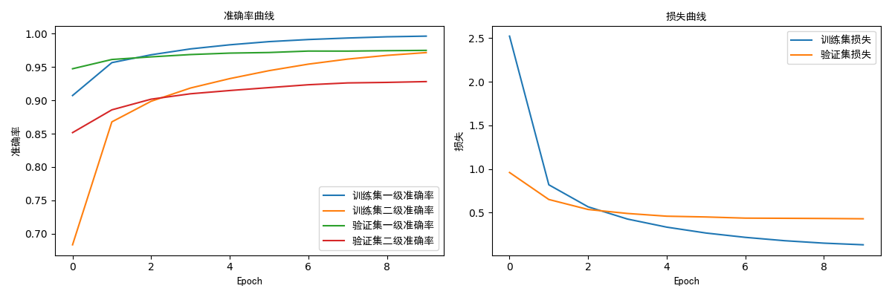
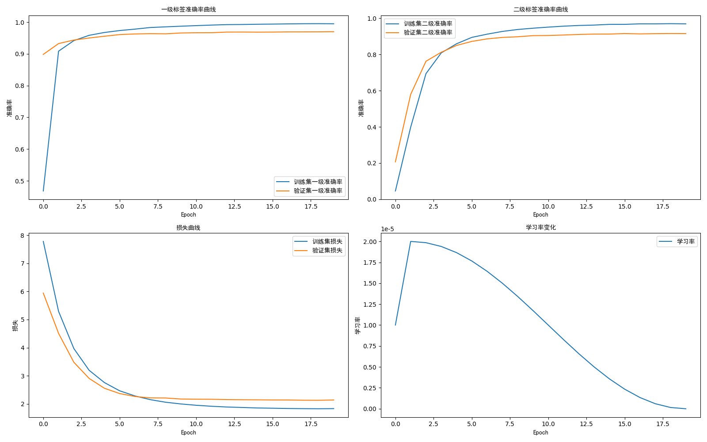
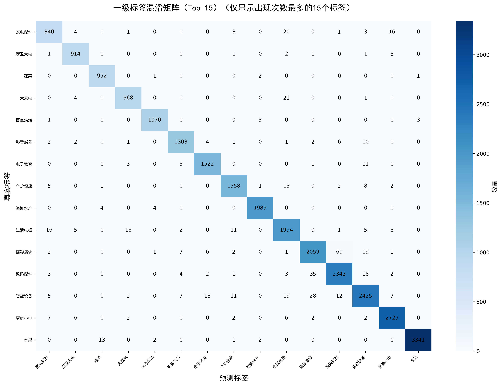
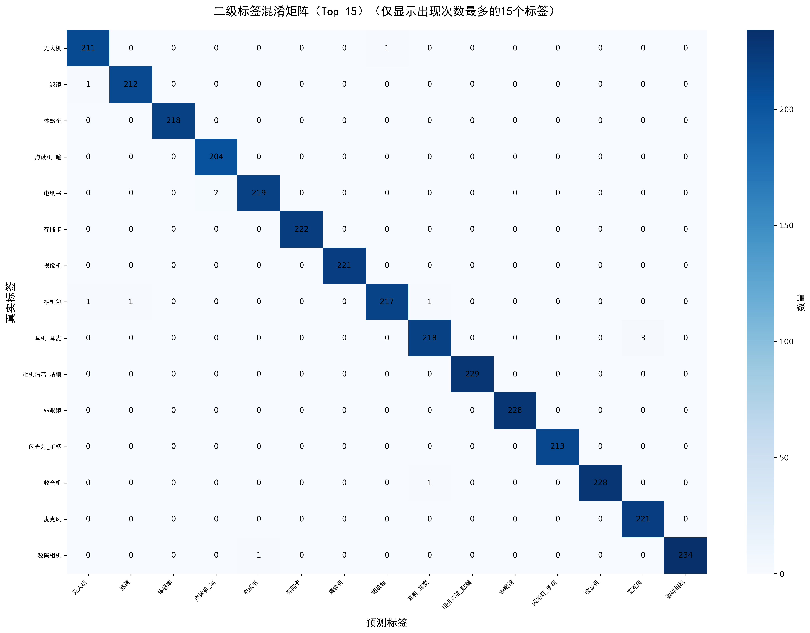
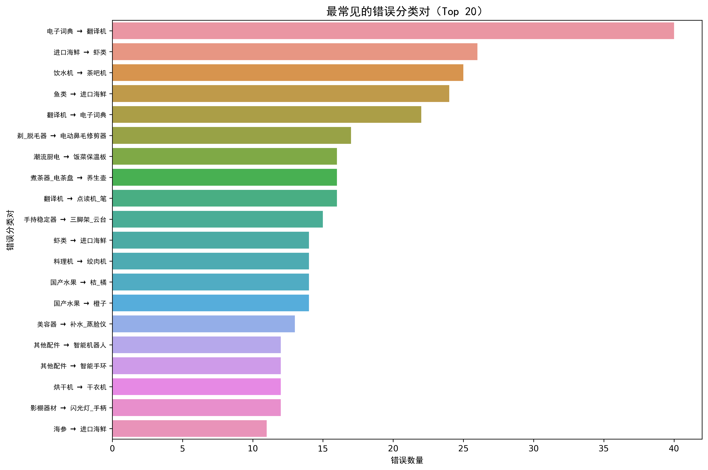
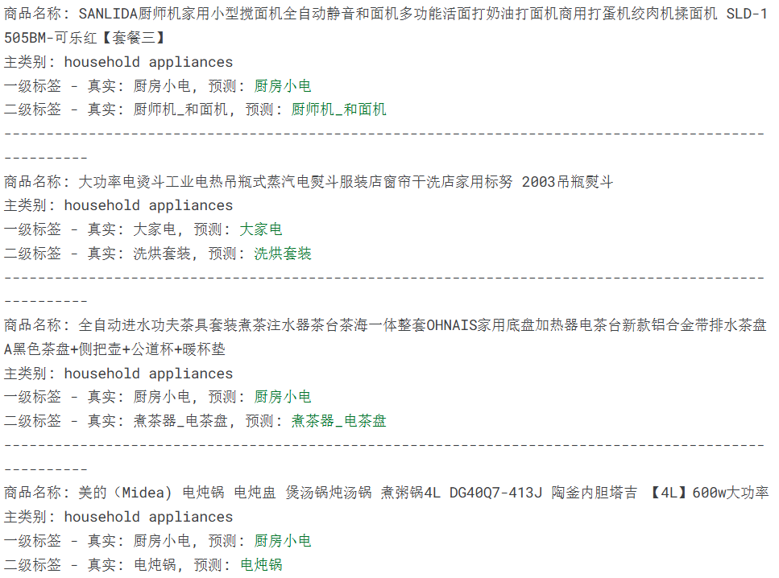
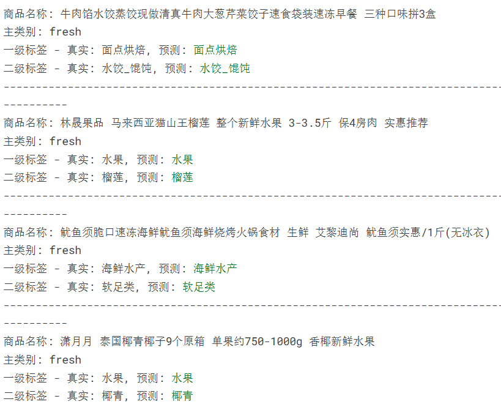
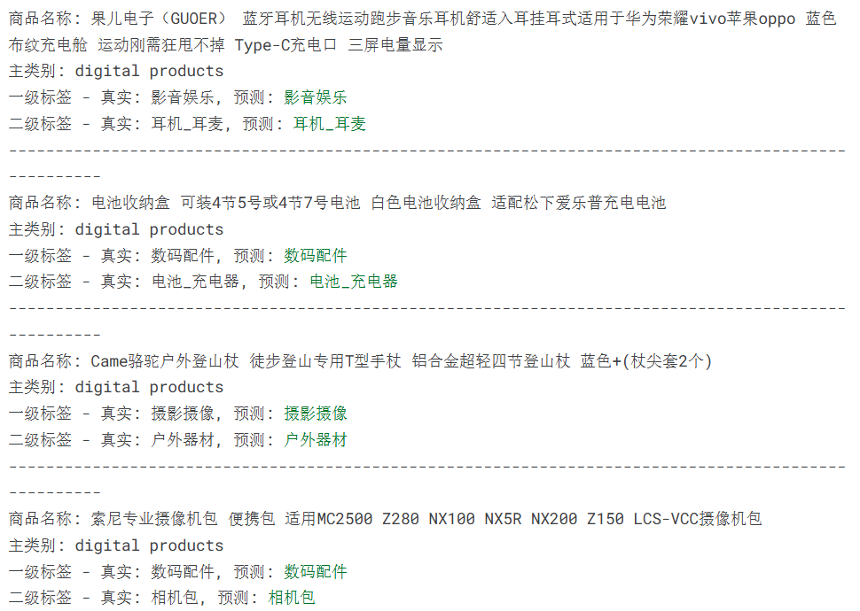

# **中文商品分类系统：基于 RoBERTa 的多级标签分类解决方案**


[](https://gitee.com/KunLiu_kk/jd-dataset)
[](https://huggingface.co/docs/transformers/model_doc/roberta)
[](https://www.mit.edu/)

---

## 📋目录

- 🌟[项目介绍](#项目介绍)
- 📊[数据集说明](#数据集说明)
- 📁[文件夹结构](#文件夹结构)
- 🧠[模型架构实现](#模型架构实现)
- 🚀[快速开始](#快速开始)
- 📈[结果展示](#结果展示)

---

## 项目介绍

本项目是一个基于预训练语言模型（BERT/RoBERTa）的中文商品分类系统，旨在实现对商品名称的自动多级标签分类。该系统能够处理复杂的商品命名文本，自动识别商品的一级和二级类别标签，为电商平台、零售系统或商品管理系统提供高效准确的商品分类服务。

系统的核心优势包括：

- **多级标签分类**：同时支持一级和二级标签的分类，提供更细致的商品类别划分
- **数据增强技术**：内置文本增强功能，通过同义词替换和随机交换等方式扩充训练数据，提高模型泛化能力
- **类别不平衡处理**：实现了加权采样器和数据集平衡策略，有效解决商品分类中常见的类别分布不均问题
- **正则化机制**：集成了标签平滑、多级 dropout 和批归一化等技术，显著降低过拟合风险
- **智能学习率调度**：采用余弦退火学习率调度器，配合学习率预热，加速模型收敛并提高性能


## 数据集说明

[数据集下载](https://gitee.com/KunLiu_kk/jd-dataset)

本项目使用的商品分类数据集包含多个主类别的商品信息，每个商品包含名称和对应的一级、二级标签。

数据集的组织结构如下：

- 根目录下按主类别划分文件夹`digital products + fresh + household appliances`
- 每个主类别文件夹下包含训练集 (`sample_train.txt`) 和测试集 (`sample_test.txt`)
- 数据文件每行格式为：`一级标签,一级标签@二级标题,商品名称`

数据示例：

```plaintext
大家电,大家电@烘干机,皮谱水果烘干机 虹魅干果机全自动食物烘干机水果蔬菜宠物肉类食品风干机小型家用
个护健康,个护健康@按摩器,安尚按摩枕双开关无线充电电动颈椎肩颈部腰部按摩仪器颈部全身按摩器家车两用按摩靠垫靠背按摩椅 充电八头双键
厨房小电,厨房小电@咖啡机,雀巢多趣酷思（Nescafe Dolce Gusto）京东定制咖啡机超级礼盒 含玫瑰金咖啡机+冷萃&美式醇香胶囊+巴黎水*2
```

系统在加载数据后会进行以下处理：

1. 解析文本文件，提取一级标签、二级标签和商品名称
2. 平衡各主类别的样本数量，避免类别不平衡问题
3. 从训练集中划分 $20\%$ 作为验证集，用于监控训练过程
4. 使用 `LabelEncoder` 对标签进行编码，转换为模型可处理的数值形式


## 文件夹结构

```makefile
Products_Name_Classification/
├── jd-dataset/               # 数据集目录
    ├── fresh/
    │   ├── sample_train.txt  # 训练数据
    │   └── sample_test.txt   # 测试数据
    └── ...                   # 更多类别
├── log/
├── output/
    ├── pic/
    ├── models/
    └── prediction_errors.csv # 错误预测样本
├── train-improve.py          # 改进后的训练代码
├── train-origin.py           # 原始的训练代码
├── requirements.txt
└── README.md
```


## 模型架构实现

本项目的核心模型`ProductClassifier`基于预训练语言模型构建，采用了多层次的网络结构：

1. **基础模型层**：
   - 支持 BERT 或 RoBERTa 预训练模型作为基础（默认使用`hfl/chinese-roberta-wwm-ext`）
   - 利用预训练模型提取商品名称的上下文语义特征
2. **特征处理层**：
   - 采用两层全连接网络对 [CLS] token 的输出进行进一步处理
   - 每层包含批归一化 (BatchNorm) 操作，加速训练并提高稳定性
   - 使用 GELU 激活函数，相比 ReLU 具有更好的梯度特性
   - 应用多级 dropout 策略（0.3, 0.21, 0.15），有效防止过拟合
3. **输出层**：
   - 两个并行的输出分支，分别对应一级标签和二级标签的分类
   - 采用 Xavier 初始化方法初始化各层权重，确保训练稳定性
4. **损失函数**：
   - 支持标准交叉熵损失和标签平滑损失
   - 标签平滑通过在真实标签周围添加少量噪声，提高模型泛化能力


## 快速开始

### 安装依赖

```bash
pip install -r requirements.txt
```

### 数据准备

1. 按照数据集说明中的格式组织你的商品分类数据
2. 将数据文件夹放置在指定路径（默认为`/kaggle/input/product-categories`）

### 运行训练

代码中包含 origin 和 improve 两个版本

```python
# 导入主训练函数
from product_classifier import train_model

# 配置训练参数并启动训练
model, tokenizer, primary_le, secondary_le, history, chinese_font = train_model(
    data_path="/path/to/your/data",       # 数据目录路径
    epochs=15,                            # 训练轮数
    batch_size=32,                        # 批次大小
    max_len=128,                          # 文本最大长度
    learning_rate=2e-5,                   # 学习率
    samples_per_category=100000,          # 每个类别的最大样本数
    model_name='hfl/chinese-roberta-wwm-ext',  # 预训练模型名称
    use_weighted_sampler=True,            # 是否使用加权采样器
    label_smoothing=0.1                   # 标签平滑系数
)
```

或者直接运行主程序：

```bash
python train-improve.py
```

### 模型预测（示例）

```python
# 加载训练好的模型
import torch
from product_classifier import ProductClassifier

checkpoint = torch.load('models/product_classifier_model.pt')
model = ProductClassifier(
    checkpoint['model_name'],
    len(checkpoint['primary_label_encoder'].classes_),
    len(checkpoint['secondary_label_encoder'].classes_)
)
model.load_state_dict(checkpoint['model_state_dict'])
tokenizer = checkpoint['tokenizer']
primary_le = checkpoint['primary_label_encoder']
secondary_le = checkpoint['secondary_label_encoder']

# 预测示例
def predict(text):
    model.eval()
    with torch.no_grad():
        encoding = tokenizer.encode_plus(
            text,
            add_special_tokens=True,
            max_length=128,
            return_token_type_ids=False,
            padding='max_length',
            truncation=True,
            return_attention_mask=True,
            return_tensors='pt',
        )
        
        primary_logits, secondary_logits, _ = model(
            input_ids=encoding['input_ids'],
            attention_mask=encoding['attention_mask']
        )
        
        primary_pred = torch.argmax(primary_logits, dim=1).item()
        secondary_pred = torch.argmax(secondary_logits, dim=1).item()
        
        return (
            primary_le.inverse_transform([primary_pred])[0],
            secondary_le.inverse_transform([secondary_pred])[0]
        )

# 测试预测
primary_label, secondary_label = predict("智能手机 6.7英寸全面屏 128G存储")
print(f"一级标签: {primary_label}, 二级标签: {secondary_label}")
```


## 结果展示

训练完成后，生成多种结果文件和可视化图表：

以下图表中

 `origin`：不使用数据增强 + BERT + epoch=10
`improve`：数据增强 + RoBERTa + epoch = 20

1. **训练历史图表**：展示训练过程中的一级 / 二级标签准确率、损失值和学习率变化曲线，直观反映模型收敛情况。

origin：



improve：



2. **混淆矩阵**：分别为一级和二级标签生成混淆矩阵，展示各类别之间的混淆程度，帮助识别容易混淆的类别对。

origin：


improve：





3. **分类报告**：包含精确率 (Precision)、召回率 (Recall) 和 F1 分数等详细指标，全面评估模型在每个类别上的表现。

4. **错误分析**：

- 保存所有错误预测样本到 CSV 文件
- 生成最常见的错误分类对图表
- 分析模型容易出错的类别和原因



```makefile
总错误样本数: 862
错误样本已保存至 prediction_errors.csv

最常见的错误类型:
编号     true_label    pred_label   count
64        摄影摄像       数码配件     60
74        数码配件       摄影摄像     35
21        厨房小电       商用电器     28
86        智能设备       摄影摄像     28
131       视听影音       影音娱乐     24
39         大家电        生活电器     21
49        家电配件       生活电器     20
88        智能设备       生活电器     19
59        影音娱乐       视听影音     19
65        摄影摄像       智能设备     19
总错误样本数: 2522
错误样本已保存至 prediction_errors.csv

最常见的错误类型:
编号      true_label    pred_label   count
809        电子词典        翻译机      40
1021       进口海鲜         虾类       26
1081        饮水机        茶吧机       25
1088         鱼类        进口海鲜      24
923         翻译机       电子词典      22
188       剃_脱毛器    电动鼻毛修剪器   17
715        潮流厨电      饭菜保温板     16
763      煮茶器_电茶盘     养生壶       16
922         翻译机       点读机_笔     16
403       手持稳定器     三脚架_云台    15
```

5. **预测示例**：随机抽取测试集中的样本，展示商品名称、真实标签和预测标签，直观展示模型的分类效果。







